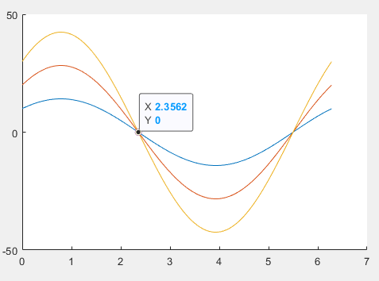
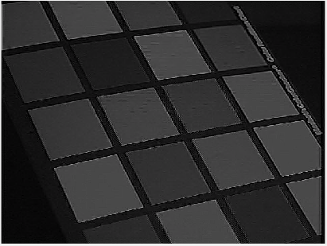
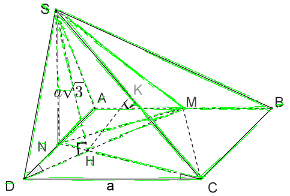
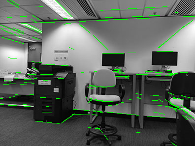
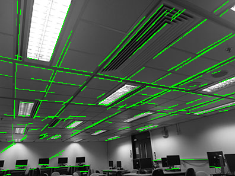
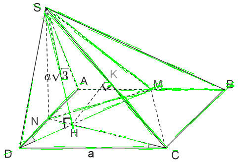
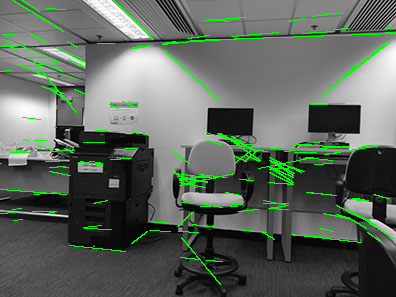
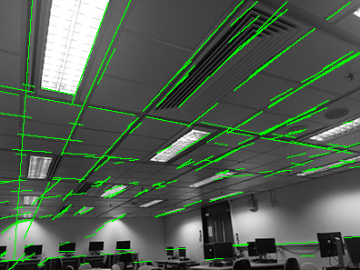

# COMP4901L Assignment 1 writeup

> WONG Yuk Chun (ycwongal, 20419764)
>
> CHEUNG Daniel (dcheungaa, 20423088)

## 1. Theory Questions

### 1.1.

Set $y = A\cos\phi$, $x = A\sin\phi$, we have
$$
\begin{align}
\rho=& x\cos\theta + y\sin\theta\\
=& A\sin\phi\cos\theta + A\cos\phi\sin\theta\\
=& A\sin(\theta + \phi)\\
\end{align}
$$

Then the amplitude $A = \sqrt{x^2 + y^2}$ and the phase $\phi = \tan^{-1}\frac{x}{y}$

### 1.2.

It is because the domain of $m$ and $c$ is $(-\infty, \infty)$ but the domain of $\rho$ and $\theta$ is finite. Assuming the origin of the Hough space is at the bottom left hand corner, $\rho$ has domain of $[0, \sqrt{W^2+H^2}]$ and $\theta$ only occupies two quadrants, consuming $[0, \pi]$. The normal form is easier to be represented in common programming languages to form the accumulative array approximating the domain for the voting process.

Intercept = $\frac{\rho}{\sin\theta}$

Slope = $-\frac{\cos\theta}{\sin\theta}$

### 1.3.

$\rho  = x\cos\theta + y\sin\theta = A\sin(\theta + \rho) \le A \le \sqrt{W^2 + H^2}$

$\theta\in [0,2\pi]$

### 1.4.

$(m,c) = (1,0)$

$(\rho, \theta) = (0, 2.3562)$ in radian

## 2. Implementation

### 2.1 Convolution

Apply a sharpening filter

### 2.2 Edge Detection

### 2.3 Hough Transform

### 2.4 Fitting line segments for visualization

### 2.5 MyHoughLines

###### MatLab

###### Custom Function

The custom implemented one is less accurate than MatLab's function. Sometimes with extra edges and many of these extra edges are not aligning with the gradients.

## 3. Experiments

The code does not work well with all the images with single set of parameters. As for the optimal set of parameter, some photos miss the big edge while some photo identify false edges. The step of thresholding the edge magnitude impact the most, therefore the optimal parameters of different images is differed by the threshold of edge detection. For example, threshold of 0.03 is good for img01 (see 2.4) but bad for img04 as you can see there are many wrong edges detected in the sky.

If the threshold is changed to 0.3, there are less false detection.

## 4. Own images

