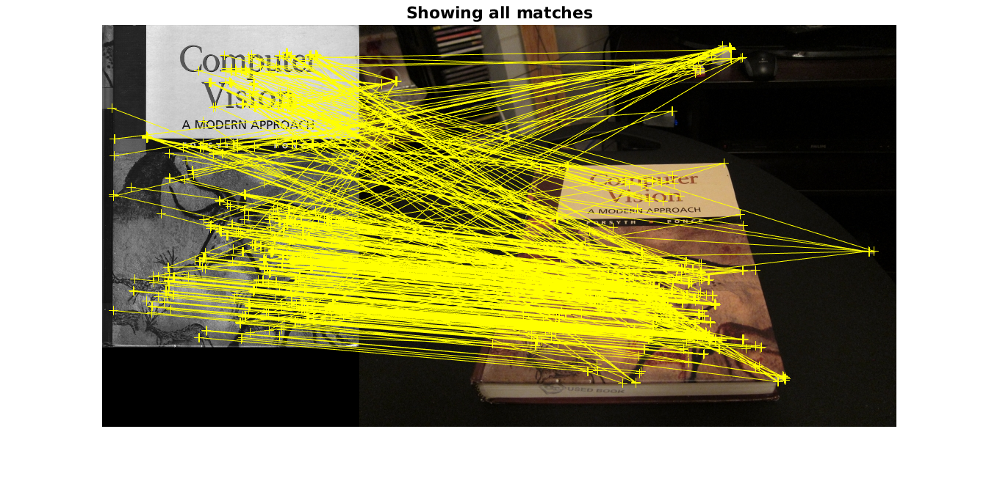

# COMP4901L Assignment 2 writeup

> WONG Yuk Chun (ycwongal, 20419764)
>
> CHEUNG Daniel (dcheungaa, 20423088)

# 1. Homographies

## Q1.1 Homography

Since $\bf{x_\pi}$ is on a plane, it only has degree of freedom of 2, then there exist a unique bijection from its local 2D coordinate on plane $\Pi$ and its 3D global coordinate. Then we can use a 2D coordinate system on $\Pi$ to represent the points on $\Pi$ in 3D. Then we can use a 3x3 matrix to represent all translation, rotation, scaling, skweling, perspective and intrinsic camera parameters to transform the 2D image coordinate system into 2D $\Pi$ plane coordinate system or inversely transform from $\Pi$ plane into image. Finally we can have a homography matrix $\bf{H}$ that can first map $\bf{x_2}$ from image 2 to plane $\Pi$ in 2D intrinsically and then map back to image 1 which correspondingly $\bf{x_1}$.

$\vec{x_1 = P_1X }, \vec{x_2 = P_2X}$

Define peusdo inverse of $\vec P_2$ as $\vec P_2^g$ so that $\vec{P_2^gP_2X = X}$, then $\vec{X = }c\vec{P_2^gx_2}$ and $\vec{P_2^g}$ have dimension 4x3, $c$ is some scalar.

Then $\vec{x_1 = }c\vec{P_1P_2^gx_2}$, define $\vec H = c\vec{P_1P_2^g}$ we have $\vec{x_1 = Hx_2}$ and $\vec H$ has dimension3x3.

## Q1.2 Correspondences

### 1.2.1.

8

### 1.2.2.

4 pairs of point correspondences

### 1.2.3.

$$
\let\vec\mathbf
\text{Assuming we have correspondences } i \text{ from 1 to 4}.\\
\text{From } \vec{x}_1^i \equiv \vec{H}\vec{x_2^i}\text{,}\\

\begin{bmatrix}x_1^i\\y_1^i\\1\end{bmatrix} \equiv 
	\begin{bmatrix}
		h_1 & h_2 & h_3\\
		h_4 & h_5 & h_6\\
		h_7 & h_8 & h_9
    \end{bmatrix}
    \begin{bmatrix}x_2^i\\y_2^i\\1\end{bmatrix}\\
\begin{bmatrix}x_1^i\\y_1^i\\1\end{bmatrix} \equiv
	\begin{bmatrix}
		h_1x_2^i + h_2y_2^i + h_3 \\
		h_4x_2^i + h_5y_2^i + h_6 \\
		h_7x_2^i + h_8y_2^i + h_9 \\
    \end{bmatrix}\\
\begin{bmatrix}x_1^i\\y_1^i\end{bmatrix} \equiv
	\begin{bmatrix}
		\frac{h_1x_2^i + h_2y_2^i + h_3}{h_7x_2^i + h_8y_2^i + h_9} \\
		\frac{h_4x_2^i + h_5y_2^i + h_6}{h_7x_2^i + h_8y_2^i + h_9} \\
    \end{bmatrix}\\
\begin{bmatrix}
	(h_7x_2^i + h_8y_2^i + h_9)x_1^i\\
	(h_7x_2^i + h_8y_2^i + h_9)y_1^i
\end{bmatrix} \equiv
	\begin{bmatrix}
		h_1x_2^i + h_2y_2^i + h_3 \\
		h_4x_2^i + h_5y_2^i + h_6
    \end{bmatrix}\\
\text{Here, we have 2 equations:}\\
- h_1x_2^i - h_2y_2^i - h_3 + (h_7x_2^i + h_8y_2^i + h_9)x_1^i = \vec{0}\\
- h_4x_2^i - h_5y_2^i - h_6 + (h_7x_2^i + h_8y_2^i + h_9)y_1^i = \vec{0}\\
\text{From here, we formulate into form of }\vec{A}_i\vec{h}=\vec{0}\\
\begin{bmatrix}
	-x_2^i & -y_2^i & -1 & 0 & 0 & 0 & x_1^ix_2^i & x_1^iy_2^i & x_1^i \\
	0 & 0 & 0 & -x_2^i & -y_2^i & -1 & y_1^ix_2^i & y_1^iy_2^i & y_1^i
\end{bmatrix}
	\begin{bmatrix}
		h_1 \\ h_2 \\ h_3 \\ h_4 \\ h_5 \\ h_6 \\ h_7 \\ h_8 \\ h_9
	\end{bmatrix} = \vec{0}\\
\therefore \vec{A}_i =
	\begin{bmatrix}
        -x_2^i & -y_2^i & -1 & 0 & 0 & 0 & x_1^ix_2^i & x_1^iy_2^i & x_1^i \\
        0 & 0 & 0 & -x_2^i & -y_2^i & -1 & y_1^ix_2^i & y_1^iy_2^i & y_1^i
    \end{bmatrix}
$$

### 1.2.4.

The trivial solution of $\mathbf{h}$ is $\mathbf{0}$.

As there are non trivial solution, null space is non empty, $\bf A$ is not full rank.

There exist an eigenvalue of 0, which implies any vector parallel to its eigenvector that correspond to this eigen value of 0 is also an eigenvector.

## Q1.3 Homography under rotation

Let $\bf{X} = \begin{bmatrix}x\\y\\z\\1\end{bmatrix}, \bf{x_1} = \begin{bmatrix}x_1\\ y_1\\ z_1 \end{bmatrix}, \bf{x_2} = \begin{bmatrix}x_2\\ y_2\\ z_2\end{bmatrix}$
$$
[x_2,y_2,z_2]^T = \vec{x_2} = \vec{K_2[R|0]X} = \vec{K_2 R} [x,y,z]^T\\
\Rightarrow [x,y,z]^T = \vec{R^{-1}K_2^{-1}x_2}
$$
Then, we have

 $\vec{x_1} = \vec{K_1[I|0]X}=\vec{K_1}[x,y,z]^T = \vec{K_1R^{-1}K_2^{-1}x_2}$

By setting $\vec{H = K_1 R^{-1} K_2^{-1}}$, we have $\vec{x_1 = H x_2}$

## Q1.4 Understanding homographies under rotation

A rotation of $2\theta$ is equivalent with rotating $\theta$ twice. Since Rotating $\theta$ is muliplying $\vec H$ for once, multiply $\vec H$ again we have total rotation of $2\theta$, equivalently we can say multiplying $\vec H^2$. More rigorously, let the homogenous coordinate of the scene point be $\vec X$, 3D coordinate be $\vec x$, we have.
$$
\vec{x_1 = K[I|0]X = Kx}\\
\vec{x_2 = K[R|0]X = KRx} \implies \vec{Rx=K^{-1}x_2} \implies \vec{x=R^{-1}K^{-1}x_2}\\
\vec{x_1 = H x_2} \text{ and } \vec{x_1 = KR^{-1}K^{-1}x_2} \implies \vec{H=KR^{-1}K^{-1}}\\
\vec{x_3 = K[R^2|0]X = KR^2x} \implies \vec{x = R^{-2}K^{-1}}\\
\vec{x_1 = KR^{-2}K^{-1}x_3 = KR^{-1}K^{-1}KR^{-1}K^{-1}x_3 = H^2x_3}
$$

## Q1.5 Limitation of the planar homography

It is because general senario the scene points have degree of freedom of 3, $\vec H$ does not have enough dimension to fully map a point from one view port to another view port.

## Q1.6 Behavior of lines under perspective projections

Perspective projection matrix $\vec P = \begin{bmatrix}
\alpha_x & s & p_x \\
0 & \alpha_y & p_y \\ 
0 & 0 & 1
\end{bmatrix}\vec{[I|0]}$

A straight line in 3D will be projected as a straight line in 2D.

Let the straight line in 3D be $\vec L(t) = \vec X + t\vec V$, where $\vec X = [x,y,z,1]^T, \vec V = [a,b,c,d], t$ is arbitary scalar.

Apply perspective projection on $\vec L$, we have 

$$
\begin{aligned}
\vec l(t)
&= \vec P\vec L(t) \\
&= \vec{P}(\vec X + t \vec V) \\
&=
\begin{bmatrix}
	\alpha_xx+sy+p_xz\\
	\alpha_yy+p_yz\\
	z
\end{bmatrix}
+t\begin{bmatrix}
	\alpha_xa+sb+p_xc\\
	\alpha_yb+p_yc\\
	c
\end{bmatrix}
\end{aligned}
$$

Convert $\vec l(t)$ from homogeneous coordinate to ordinary 2D coordinate, we have
$$
\vec l(t) = 
\begin{bmatrix}
	\frac{\alpha_xx+sy+p_xz + t(\alpha_xa+sb+p_xc}{z+tc})\\
	\frac{\alpha_yy+p_yz + t(\alpha_yb+p_yc)}{z+tc}
\end{bmatrix}
$$
By taking $t' = \frac{1}{z+tc}$, $t’$ is still an arbitary real constant scalar. Then we have
$$
\vec l(t') = \begin{bmatrix}
	\alpha_xx+sy+p_xz\\
	\alpha_yy+p_yz
\end{bmatrix}
+t'\begin{bmatrix}
	\alpha_xa+sb+p_xc\\
	\alpha_yb+p_yc
\end{bmatrix}
$$
Which is also an equation of straight line.

# Q2.1

## Q2.1.1 FAST vs Harris

The FAST detector is, given a potential corner pixel $p$ and a constant radius $r$, for all pixel $q$ which have a distance $r$ away from $p$, suppose $g(p)$ is getting the grayscale value at $p$, $N$ be number of $q$ such that $|g(p)-g(q)|>\epsilon$ where $\epsilon$ is some positive constant threshold, report $p$ is a corner if $N$ is greater than some certain threshold. There is an additional opimization that is chose 4 points from the set of $q$ where each of them are 90 degree apart, report $p$ is not a corner before checking other $q$ if less than 3 of the 4 points do not have significant different in grayscale level with $p$. In worse case, when detecting a single corner, number of neighbours that FAST need to calculate is bounded by $8r$.

In Harris corner detector, we need to calculate the gradient of the whole image and then for each potential corner, it sum the gradients in the kernal to get $\sum I_x^2$, $\sum I_y^2$ and $\sum I_x I_y$. In all case, when detecting a single corner, number of the neightbours that Harris need to calculate is $O(r^2)$ where $r$ is the kernal size, Harris also need to calculate keep gradient image in x and y direction in the memory. Hence FAST is more calculation and memory efficient than Harris corner detection, meanwhile less rigourous than Harris corner detector that it does not take the physical definition of corner in account, that is a corner is defined by two edges in different direction.

## Q2.1.2 BRIEF Descriptor

The BRIEF descriptor gives each feature point a binary string of certain length, each bit is determined by whether a pair of pixel within the window has difference greater than some certain threshold, then two corners have highest corresponding bit matched are paired. In contrast with the filter banks which describes corners using the reponse of various filter, BRIEF uses a single bit string, it is much faster, however it is sensitive with noise, scale and rotation.

## Q2.1.3 Matching Methods

Hamming distance compares the number of bits needed to be flipped in order to make two bit string the same. In the case of BRIEF descriptor, it actually means number of sample pairs that the two corners does not match, where the Euclidean distance does not have a physical meaning on this, and don’t need to call the expensive sqrt operation.

## Q2.1.4

## Q2.1.5

There is a clear correlation between the rotation difference of the images and the decrease in point correspondences. The reason for this is BRIEF creates a representation of a spacial patch around the target points using random (x, y) pairs intensity comparisons and compare these representations to some targets, thus they are sensitive to rotations since the larger the differences, the more difference there will be in the (x, y) pair insensity comparisons. So for instance, a plain dot will not be much affected by the rotation, but areas where patches containing multiple features, will be penalized by the algorithm.

Other descriptors like SIFT and SURF are invariant to rotations. Because they take rotations into consideration when designing the algorithm. ORB is then a variant of BRIEF that adds invariance of rotation to the algorithm. Under these descriptors, the plot will change significantly, for number of matching points against degrees of rotations will result in a more steady and constant line.
