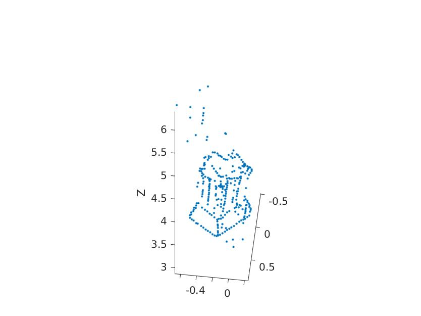
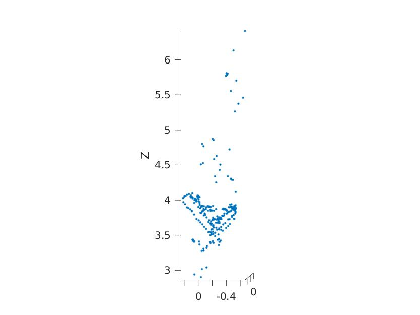
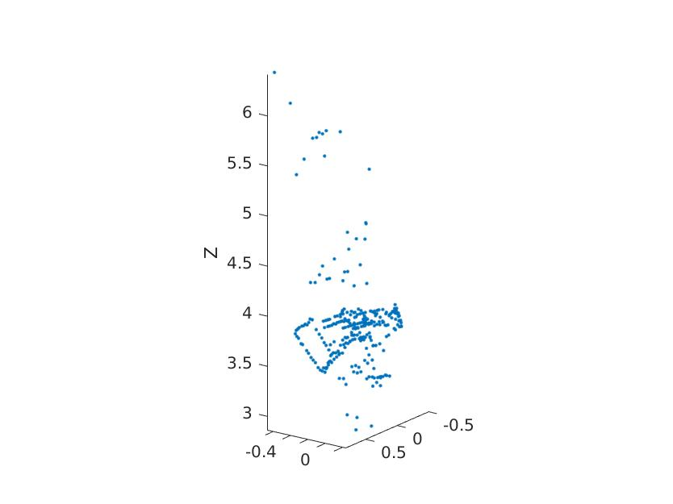
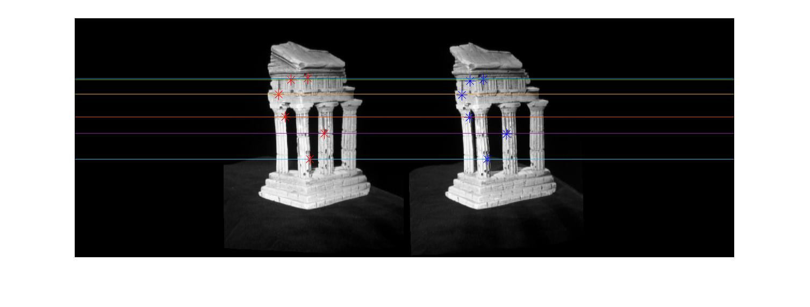
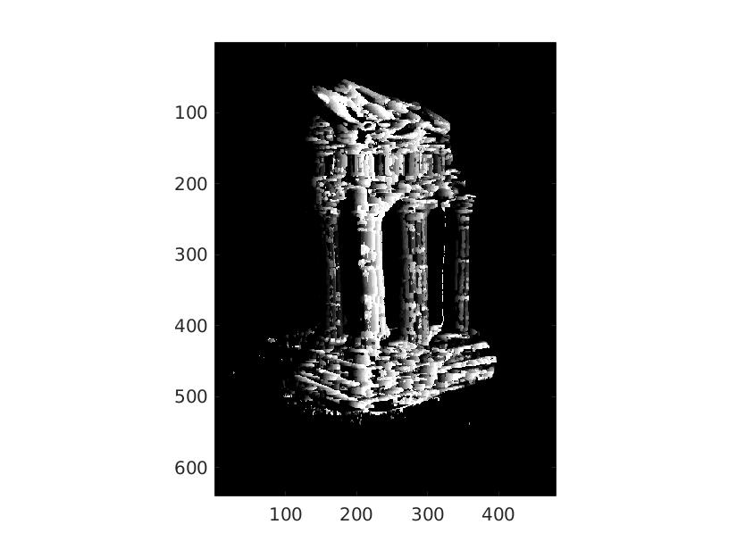
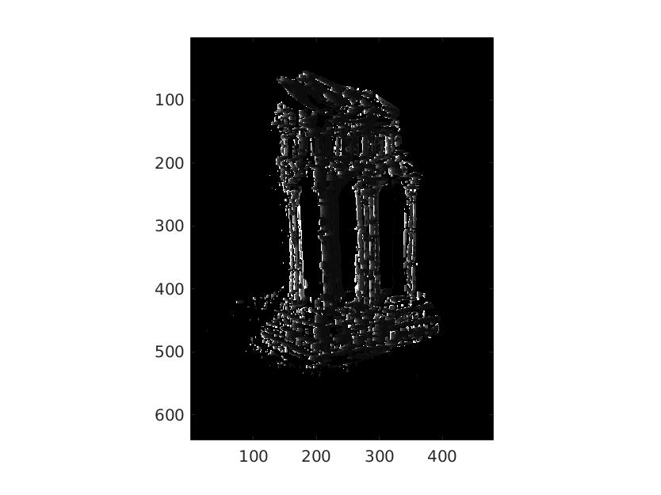
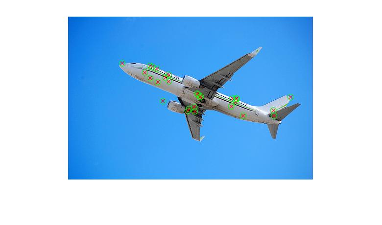
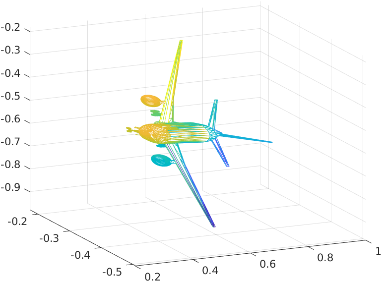
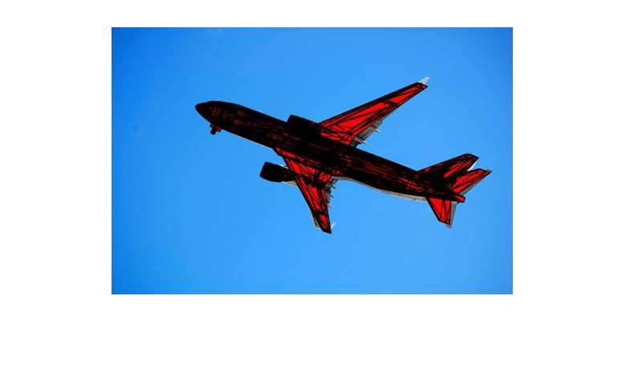

# COMP4901L Assignment3 Writeup

>WONG Yuk Chun (ycwongal, 20419764)
>
>CHEUNG Daniel (dcheungaa, 20423088)

## 2.1. Triangulation

$$
\gamma = \pi - \alpha - \beta\\
\frac{\sin\gamma}{b} = \frac{\sin\alpha}{d}\\
d=\frac{b\sin\alpha}{\sin(\pi-\alpha-\beta)}=\frac{b\sin\alpha}{\sin(\alpha+\beta)}\\
x=d\cos\beta=\frac{b\sin\alpha\cos\beta}{\sin(\alpha+\beta)}\\
y=d\sin\beta=\frac{b\sin\alpha\sin\beta}{\sin(\alpha+\beta)}
$$

## 2.2. Fundamental Matrix

When a point $\vec X$ in 3D is mapped to $\vec x$ in image 1 and $\vec y$ in image 2, the fundamental matrix shall satisfy the following property
$$
\vec x^T F\vec y = 0
$$
Since the principle point is mapped to origin of both images, we have
$$
\begin{aligned}
\begin{bmatrix}0&0&1\end{bmatrix}\begin{bmatrix}a&b&c\\d&e&f\\g&h&i\end{bmatrix}\begin{bmatrix}0\\0\\1\end{bmatrix} = 0\\
\begin{bmatrix}0&0&1\end{bmatrix}\begin{bmatrix}c\\f\\i\end{bmatrix} = 0\\
i=0
\end{aligned}
$$
Which implies the $F_{3,3}$ element of the fundamental matrix $F$ is 0

## 3.1 Sparse Reconstruction
### 3.1.1 Implement the eight point algorithm

$$
\mathbf{F}=\begin{bmatrix}
	0&		0&		0\\
	0&		0&		0.0005\\
	0&		-0.0005&	0.0021
\end{bmatrix}
$$


### 3.1.2 Find epipolar correspondences


Manhatten distance was used with a sliding square window size of length 7.

The operation consistently success at locating feature points of corners or dots and fails to find points of flatter regions. The reason of this is because there still are subtle color variations between the 2 images that may constitude to being "noise" in the operation. Without strong features of large gradient changes, it is quite hard to find the similar patch of space in the other region.

### 3.1.3 Write a function to compute the essential matrix

$$
\mathbf{E} = \begin{bmatrix}
	0.0040  & -0.0433  & -0.0192 \\
-0.1498 &  -0.0009   & 0.7264 \\
0.0019  & -0.7352  & -0.0008 
\end{bmatrix}
$$

#### 3.1.4 Implement triangulation

A correct extrinsic camera should be able to project the 3D point back to the 2D coordinate in the image. When projecting the 2D coordinate from the images, they should be focus in front of the images, not the back since this violate the condition when the images are taken. Since we can indicate a 3D point is in front of the image if the 3D coordinate has Z component positive, the camera matrix which can project most point to positive Z has the highest likelyhood of being the correct camera matrix.

Image 1 has a reprojection error of 0.4504 pixel, image 2 has a reprojection error of 0.4541 pixel

#### 3.1.5 Write a test script that uses templeCoords








## 3.2 Dense Reconstruction

### 3.2.1 Image Rectification



### 3.2.2 Disparity



### 3.3.3 Depth map



## 3.3 Pose Estimation

### 3.3.1 Estimate camera matrix P

Output

```
Reprojected Error with clean 2D points is 0.0000
Pose Error with clean 2D points is 0.0000
------------------------------
Reprojected Error with noisy 2D points is 2.1979
Pose Error with noisy 2D points is 0.0541
```

### 3.3.2 Estimate intrinsic and extrinsic parameters of P

```

Intrinsic Error with clean 2D points is 0.0000
Rotation Error with clean 2D points is 0.0000
Translation Error with clean 2D points is 0.0000
------------------------------
Intrinsic Error with clean 2D points is 0.9308
Rotation Error with clean 2D points is 0.2760
Translation Error with clean 2D points is 0.6063
```

(should it be noisy instead)

#### 3.3.3 Project a CAD model to the image

##### 3.3.3.4 plot the given x and projection of X

Key: red cross is x, green circle is projection of X on the image



##### 3.3.3.5 Rotated CAD model



##### 3.3.3.6 Project the whole CAD onto the image



