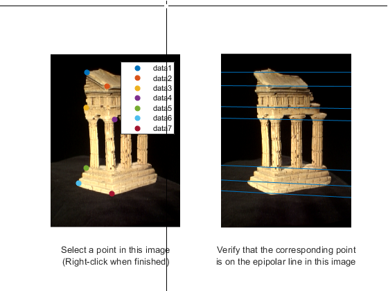
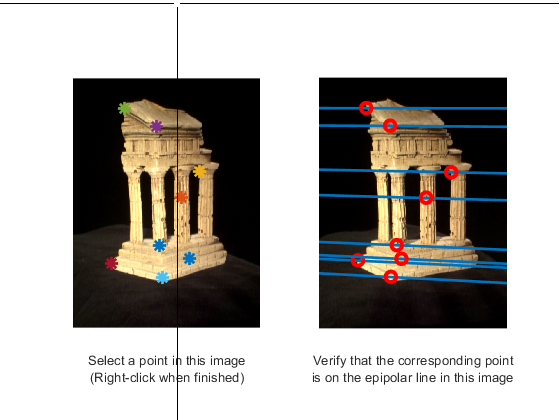

# COMP4901L Assignment3 Writeup

>WONG Yuk Chun (ycwongal, 20419764)
>
>CHEUNG Daniel (dcheungaa, 20423088)

## 2.1. Triangulation

$$
\gamma = \pi - \alpha - \beta\\
\frac{\sin\gamma}{b} = \frac{\sin\alpha}{d}\\
d=\frac{b\sin\alpha}{\sin(\pi-\alpha-\beta)}=\frac{b\sin\alpha}{\sin(\alpha+\beta)}\\
x=d\cos\beta=\frac{b\sin\alpha\cos\beta}{\sin(\alpha+\beta)}=\frac{b}{\cos\alpha\sin\beta}\\
y=d\sin\beta=\frac{b\sin\alpha\sin\beta}{\sin(\alpha+\beta)}
$$

## 2.2. Fundamental Matrix

When a point $\vec X$ in 3D is mapped to $\vec x$ in image 1 and $\vec y$ in image 2, the fundamental matrix shall satisfy the following property
$$
\vec x^T F\vec y = 0
$$
Since the principle point is mapped to origin of both images, we have
$$
\begin{aligned}
\begin{bmatrix}0&0&1\end{bmatrix}\begin{bmatrix}a&b&c\\d&e&f\\g&h&i\end{bmatrix}\begin{bmatrix}0\\0\\1\end{bmatrix} = 0\\
\begin{bmatrix}0&0&1\end{bmatrix}\begin{bmatrix}c\\f\\i\end{bmatrix} = 0\\
i=0
\end{aligned}
$$
Which implies the $F_{3,3}$ element of the fundamental matrix $F$ is 0

## 3.1.1 Implement the eight point algorithm

$$
\mathbf{F}=\begin{bmatrix}
	0&		0&		0\\
	0&		0&		-0.0015\\
	0&		0.0015&	0.0064
\end{bmatrix}
$$




## 3.1.2 Find epipolar correspondences



Manhatten distance was used with a sliding square window size of length 7.

The operation consistently success at locating feature points of corners or dots and fails to find points of flatter regions. The reason of this is because there still are subtle color variations between the 2 images that may constitude to being "noise" in the operation. Without strong features of large gradient changes, it is quite hard to find the similar patch of space in the other region.

## 3.3 Pose Estimation

### 3.3.1 Estimate camera matrix P

Output

```
Reprojected Error with clean 2D points is 0.0000
Pose Error with clean 2D points is 0.0000
------------------------------
Reprojected Error with noisy 2D points is 2.1979
Pose Error with noisy 2D points is 0.0541
```

### 3.3.2 Estimate intrinsic and extrinsic parameters of P

```
Intrinsic Error with clean 2D points is 0.0000
Rotation Error with clean 2D points is 0.0000
Translation Error with clean 2D points is 1.4656
------------------------------
Intrinsic Error with clean 2D points is 0.8852
Rotation Error with clean 2D points is 0.1126
Translation Error with clean 2D points is 1.5269
```

(should it be noisy instead)

