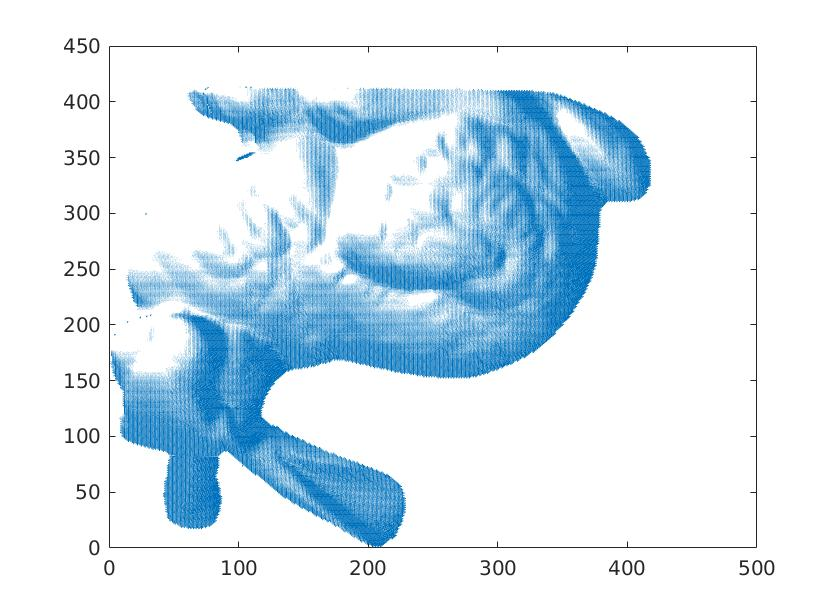
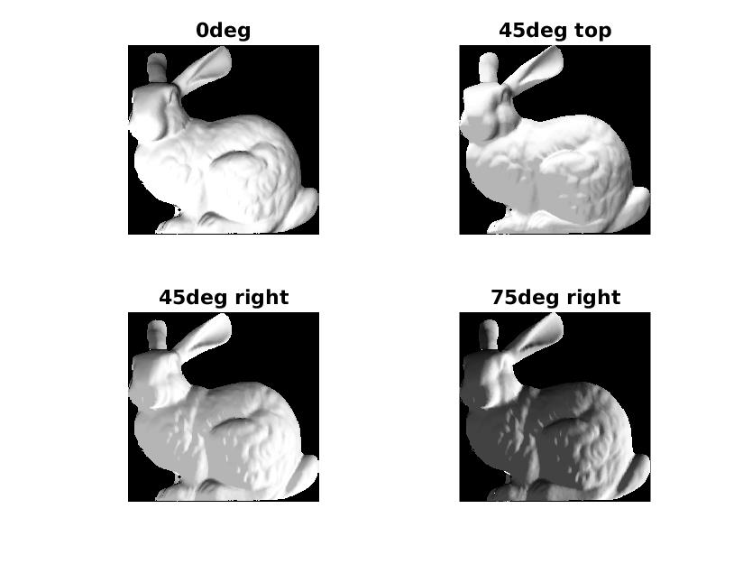
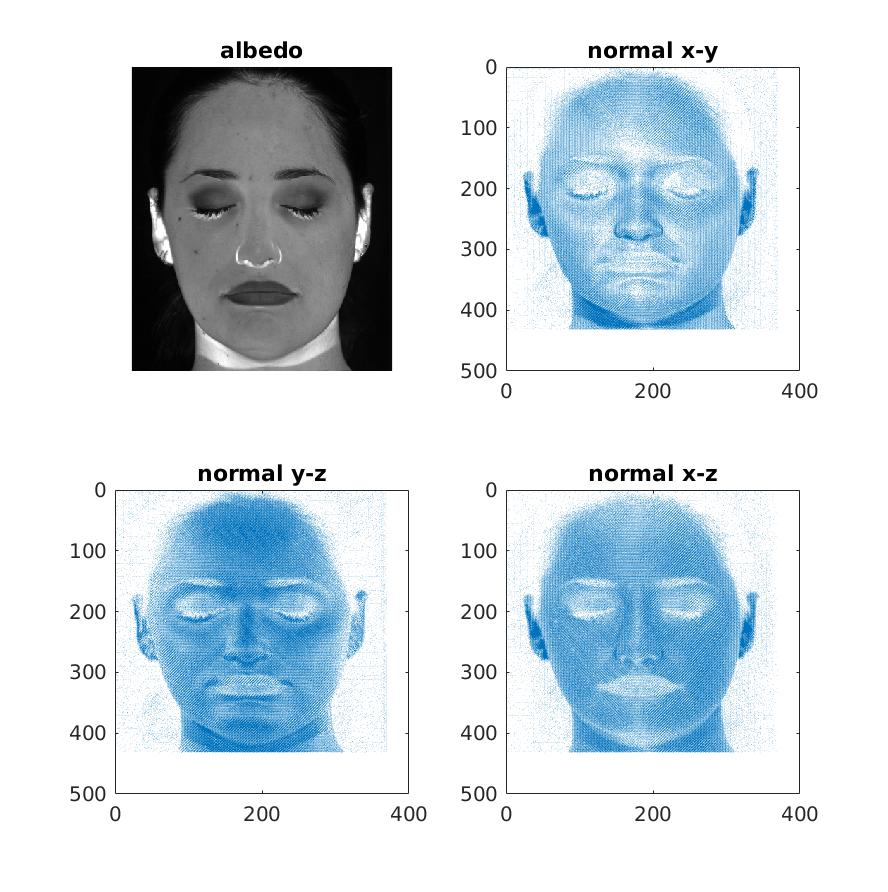
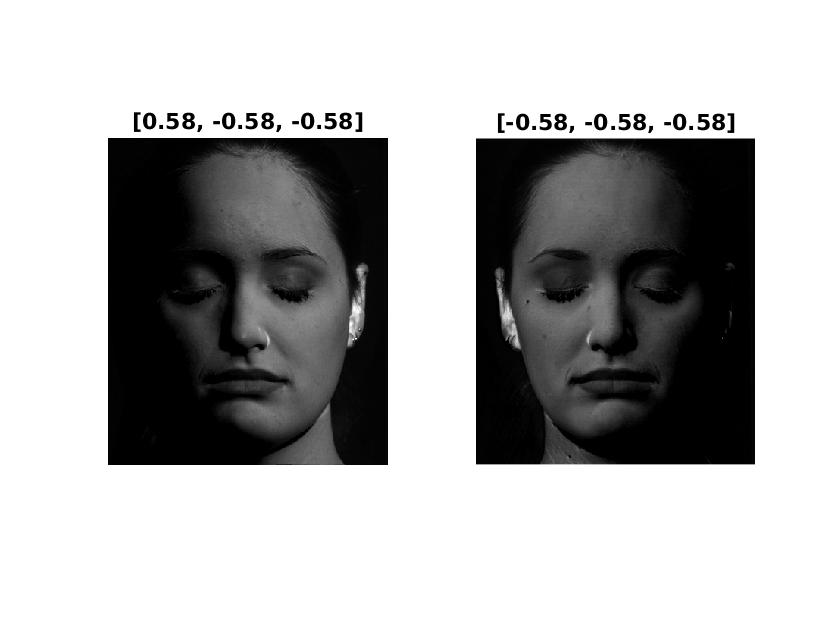
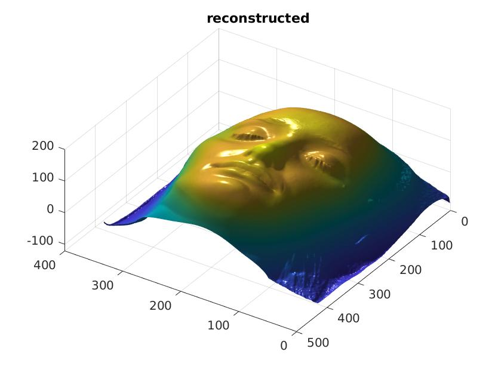
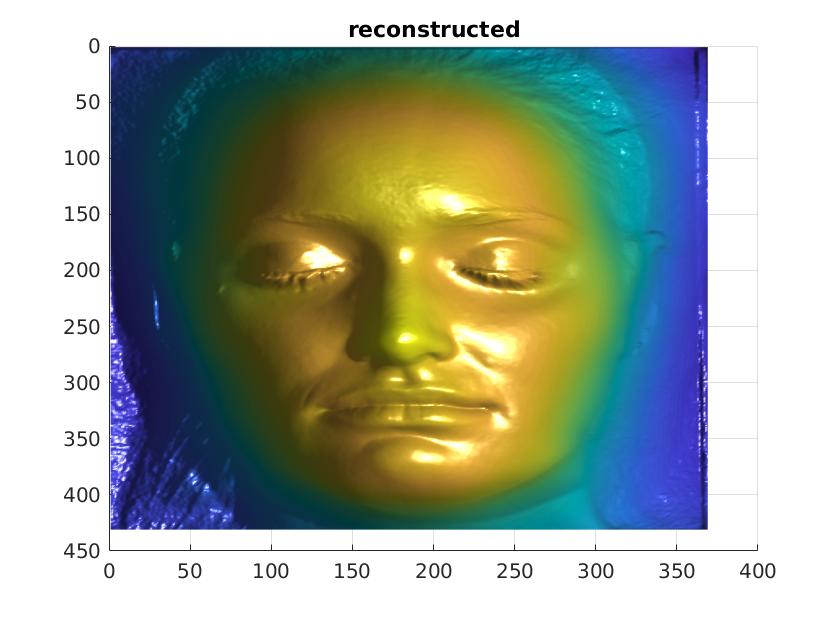
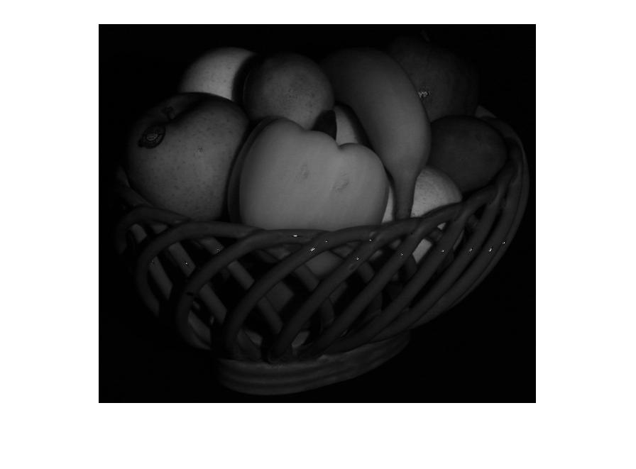
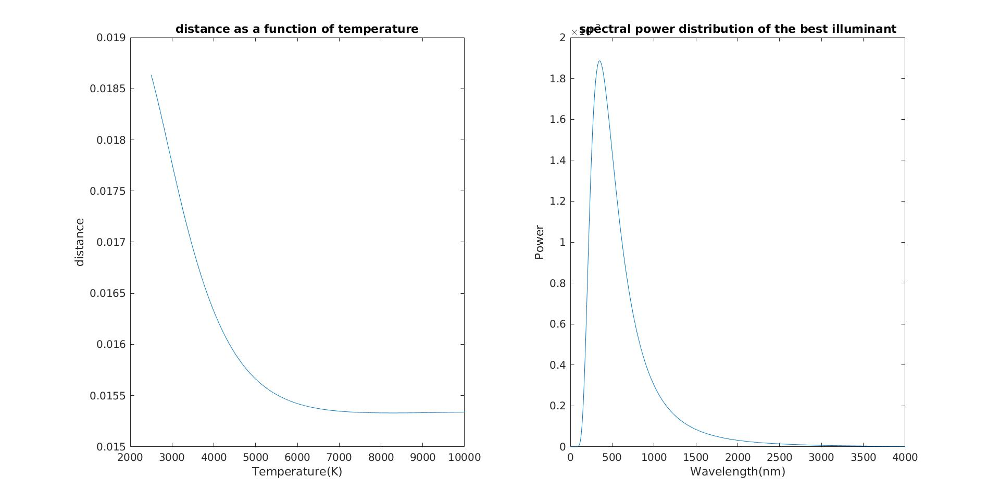

# COMP4901L Assignment4 Writeup

>WONG Yuk Chun (ycwongal@connect.ust.hk, 20419764)

### 1.1 Lambertian alberdo

By conservation of energy,
$$
\newcommand{\norm}[1]{\left\lVert#1\right\rVert}
\begin{aligned}
0\le \int_{\Omega_{out}}f(\hat{\omega}_{in}, \hat{\omega}_{out})\cos{\theta_{out}}d\hat{\omega}_{out} &\le1\\
\int_{\Omega_{out}}\frac{\rho}{\pi}\cos{\theta_{out}}d\hat{\omega}_{out} &\le1\\
\int_{-\pi}^\pi\int_0^{\frac{\pi}{2}}\frac{\rho}{\pi}\cos{\theta_i}\sin{\theta_i}d\theta_id\phi_i &\le1\\
\int_{-\pi}^\pi\int_0^{\frac{\pi}{2}}\frac{\rho}{2\pi}\sin{2\theta}d\theta d\phi &\le1\\
\int_{-\pi}^\pi\frac{\rho}{2\pi}[-\frac{1}{2}\cos{2\theta}]_0^\frac{\pi}{2} d\phi &\le1\\
\int_{-\pi}^\pi\frac{\rho}{2\pi}d\phi&\le1\\
\frac{\rho}{2\pi}[\phi]_{-\pi}^\pi &\le 1\\
\implies 0\le \rho &\le 1
\end{aligned}
$$

### 1.2 Foreshortening

#### 1.2.1 Solid angle

The solid angle at $X_1$
$$
d\omega_1 = \frac{dA}{D^2}
$$

The solid angle at $X_2$
$$
d\omega_2 = \frac{dA}{(\frac D {\cos \alpha})^2}=\frac{dA \cos^2\alpha}{D^2}
$$

#### 1.2.2 Irradiance ratio

$$
E(\omega) = \int_\Omega L(\omega_{in})\cos\theta_{out} d\omega
$$

Consider $X_1$ and $X_2$ as infinitesimal points, we have
$$
E(X_1) = L \frac{dA}{D^2}\\
E(X_2) = L\frac{dA\cos^2\alpha}{D^2}\\
E(X_1)/E(X_2) = \frac{1}{\cos^2\alpha}
$$

### 1.3 Simple rendering

#### 1.3.1 Normal visualization

#### 1.3.2 light source at $\hat s = (0,0,1)$

The pixel intensity is albedo constant times dot product of light direction and normal direction time light intensity. Assume the light intensity is always 1, albedo always 1. Light direction is same as view port direction (0,0,1), the dot product of light direction and any normal would only keep the z-component of the normal vector. Multiply all of these for all pixels, we have the z component of the normal map, aka N(:,:,3).

#### 1.3.3 light source at 45deg up, 45 deg right, 75deg right

Some part of the rabbit should be blocked since the path to light is blocked by other part of the rabbit, that is, shadows are ignored. z-component of normal along silhouette may not be 0.

### 1.4 Photometric stereo

#### 1.4.1 Solve for albedo and normal

#### 1.4.2 Nostrils error

In using photometric stereo, we are making an assumption of no shadow, however nostrils have shadow. We can calculate albedo of nostrils using only photos that do not generate shadow around nostrils.

#### 1.4.3 Stereo recover

#### 1.4.4 Integrate frankot

### 1.5 Dichromatic reflectance

#### 1.5.1

Let $\v c=(c_R(\v u), c_G(\v u), c_B(\v u))$
$$
\begin{aligned}
\v{C}(\v u) &= \angp{\v n(\v u), \v l}\int_\lambda \v c I(\lambda)f(\lambda,\hat{\omega}_i,\hat{\omega}_o)d\lambda \\

&=  \angp{\v n(\v u), \v l}\int_\lambda \v cI(\lambda) (f_d(\lambda)+f_s(\hat{\omega}_i,\hat{\omega}_o))d\lambda \\

\text{and }\v{C}(\v u) &= \angp{\v n(\v u), \v l}\v d(\v u) + g_s(\v u)\v s
\end{aligned}
$$

By comparing like terms, we have
$$
\begin{aligned}
\v{d}(\v{u}) &= \int_\lambda(c_R(\v u), c_G(\v u), c_B(\v u))  I(\lambda)f_d(\lambda)d\lambda\\
g_s(\v u)\v s &= \angp{\v n(\v u), \v l}\int_\lambda \v c I(\lambda)f_s(\hat{\omega}_i,\hat{\omega}_o)d\lambda
\end{aligned}
$$
Since $f_s(\hat{\omega}_i,\hat{\omega}_o)\angp{\v n(\v u), \v l}$ is a function depends non-linearly on $\hat n(\v u)$, we can set that as $g_s$ and have $\v s = \int_\lambda(c_R(\v u), c_G(\v u), c_B(\v u))I(\lambda)d\lambda$.

#### 1.5.2

As $\v{r_1},\v{r_2}$ orthogonal to $\v{s}$, we have $\angp{\v{r_1},\v{s}}=\angp{\v{r_2},\v{s}}=0$.
$$
\newcommand{\angp}[1]{\langle #1 \rangle}
\newcommand{\v}[1]{\vec{#1}}
\angp{\v{r_1},\hat{C}(\hat{u})}=\angp{\v{r_1},\angp{\v{n},\v{l}}\v{d}} + \angp{\v{r_1},g\v{s}} = \angp{\v{r_1},\angp{\v{n},\v{l}}\v{d}}\\
\angp{\v{r_2},\hat{C}(\hat{u})}=\angp{\v{r_2},\angp{\v{n},\v{l}}\v{d}} + \angp{\v{r_2},g\v{s}} = \angp{\v{r_2},\angp{\v{n},\v{l}}\v{d}}
$$

Obviously both of them independent of $g\v s$, that is specular term equals 0, then it is independent from $f_s(\hat \omega_i,\hat \omega_o)$.

$\v d$ is independent from $\v n$ and the inner product is linear, so both component depend linearly on the surface normal.

#### 1.5.3

$$
\begin{aligned}
J(\v u) &= \sqrt{(\angp{\v{r_1}, \angp{\v n(\v u), \v l}\v d})^2 + (\angp{\v{r_1}, \angp{\v n(\v u), \v l}\v d})^2}\\
&=|\angp{\v n(\v u), \v l}|\sqrt{\angp{\v{r_1}, \v d}^2 + \angp{\v r_2,\v d}^2}\\
&=\angp{\v n(\v u), \v l}\sqrt{\angp{\v{r_1}, \v d}^2 + \angp{\v r_2,\v d}^2}\\
\end{aligned}
$$

Since original 2-channel image already independent from specular term, its gray scale image must be independent from the specular term.

Since $\angp{\v n(\v u),\v l}$ must be positive or it is intersecting from the bottom side of the surface  which is impossible. Then it depends linearly on the normal.

#### 1.5.4

This is useful since the specularity are removed, which specularity introduce some view angle specific term to the picture that is not good for multiple photos computer vision processing. After that whole picture only depends linearly on surface normal and can produce better result for stereo reconstruction.

### 1.6 Color metamers

#### 1.6.1

$$
\v C_f = \int_\lambda \v C(\lambda) f(\lambda)l(\lambda)d\lambda = R(\v f\odot\v l)=L_f\v l
$$

$i^{th} \text{column of } (L_f)_i=R(:,i) f(i) $.

#### 1.6.2

$$
\begin{aligned}
\norm{\v C_f-\v C_g} &= \norm{L_f\v l-L_g\v l}\\
\end{aligned}
$$

#### 1.6.4

The best temperature is 8300K, precision 50K.

