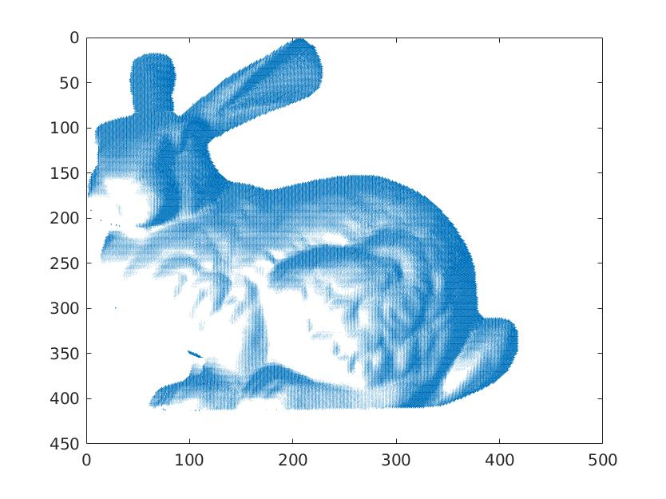
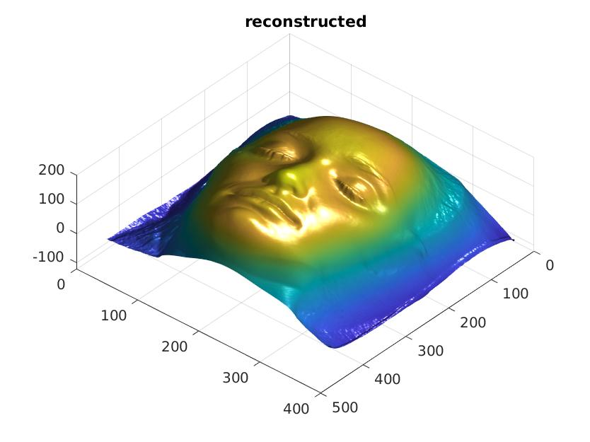

# COMP4901L Assignment4 Writeup

>WONG Yuk Chun (ycwongal, 20419764)

### 1.1 Lambertian alberdo

By conservation of energy,
$$
\begin{aligned}
0\le \int_{\Omega_{out}}f(\hat{\omega}_{in}, \hat{\omega}_{out})\cos{\theta_{out}}d\hat{\omega}_{out} &\le1\\
\int_{\Omega_{out}}\frac{\rho}{\pi}\cos{\theta_{out}}d\hat{\omega}_{out} &\le1\\
\int_{-\pi}^\pi\int_0^{\frac{\pi}{2}}\frac{\rho}{\pi}\cos{\theta_i}\sin{\theta_i}d\theta_id\phi_i &\le1\\
\int_{-\pi}^\pi\int_0^{\frac{\pi}{2}}\frac{\rho}{2\pi}\sin{2\theta}d\theta d\phi &\le1\\
\int_{-\pi}^\pi\frac{\rho}{2\pi}[-\frac{1}{2}\cos{2\theta}]_0^\frac{\pi}{2} d\phi &\le1\\
\int_{-\pi}^\pi\frac{\rho}{2\pi}d\phi&\le1\\
\frac{\rho}{2\pi}[\phi]_{-\pi}^\pi &\le 1\\
\implies 0\le \rho &\le 1
\end{aligned}
$$

### 1.2 Foreshortening

#### 1.2.1 Solid angle

The solid angle at $X_1$
$$
d\omega = \frac{dA}{D^2}
$$

The solid angle at $X_2$
$$
d\omega = \frac{dA\cos\alpha}{D^2}
$$

#### 1.2.2 Irradiance ratio

The radiance of $X_1$ is $L(X_1)=L$, $X_2$ is $L(X_2)=L\cos\alpha$.

By BRDF $f=L(X)/E(X)$ is same everywhere

$$
\begin{aligned}
\frac{L(X_1)}{E(X_1)} &= \frac{L(X_2)}{E(X_2)} = f\\
\frac{E(X_1)}{E(X_2)} &= \frac{L(X_1)}{L(X_2)} = \frac{1}{\cos\alpha}
\end{aligned}
$$

### 1.3 Simple rendering

#### 1.3.1 Normal visualization

#### 1.3.2 light source at $\hat s = (0,0,1)$

The received intensity is albedo constant times dot product of light direction and normal direction time light intensity. Assume the light intensity is always 1, albedo equals 1( all light are reflected). Light direction is same as same as view port direction, the dot product of light direction and view port direction would only keep the z-component of the normal vector. Multiply all of these for all pixels, we have the z component of the normal map.

#### 1.3.2 light source at 45deg up, 45 deg right, 75deg right

Some part of the rabbit should be blocked since the path to light is blocked by other part of the rabbit, aka shadow. Transparency and specularity are ignored. Distance attenuation is ignored. 

### 1.4 Photometric stereo

#### 1.4.1 Solve for albedo and normal

#### 1.4.2 Nostrils error

In using photometric stereo, we are making an assumption of no shadow, however nostrils have shadow. We can calculate albedo of nostrils using only photos that do not generate shadow around nostrils

#### 1.4.3 Stereo recover

#### 1.4.4 Integrate frankot

### 1.5 Dichromatic reflectance

### 1.6 Color metamers

