# COMP4901L Assignment5 Writeup

>WONG Yuk Chun (ycwongal, 20419764)
>
>CHEUNG Daniel (dcheungaa, 20423088)

## 1.1 Extract Filter Responses

Original


Filter 1 on L,A,B respectively

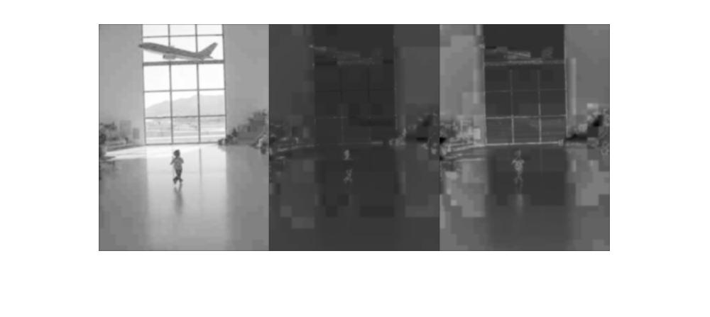

Filter 6 on L,A,B respectively

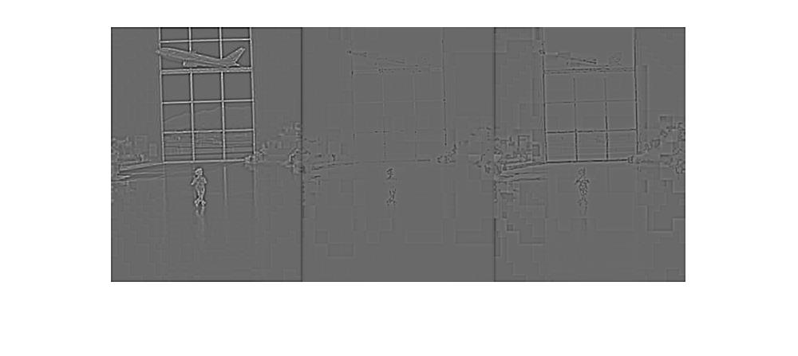

Filter 10 on  L,A,B respectively

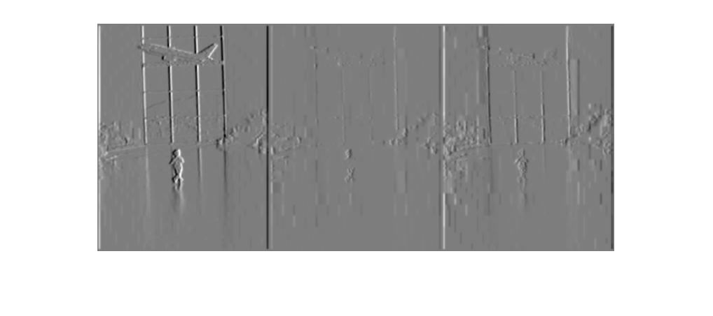

There are some squares in the images, which is due to the lossy compression of JPG format.

The LAB color system is based on human inceptions on color, in contrast with RGB system that is based on hardware requirement. L refer to the brightness, a and b refer to the color balance. We use Lab color system to simulate human inception on colors.

## 1.2 Collect sample of points from image

Blue circles are random points, red circles are harris corners

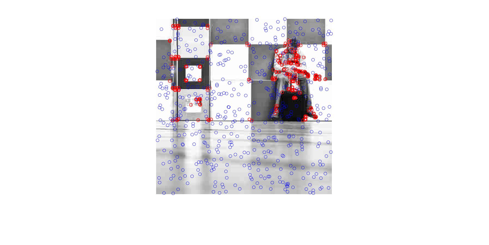

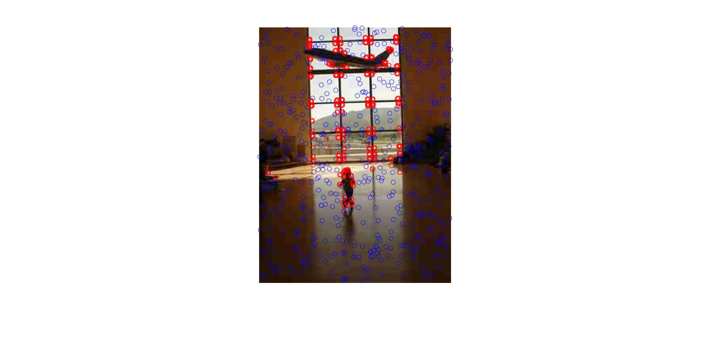

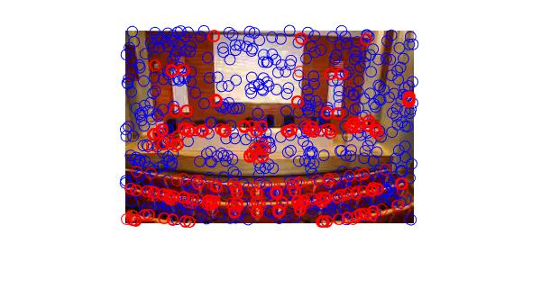

## Q2.1 Convert image to word map

Left: original, Center: random, Right: Harris

1. 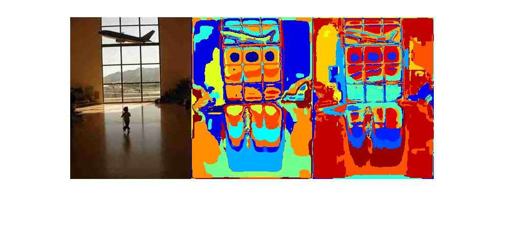

2. 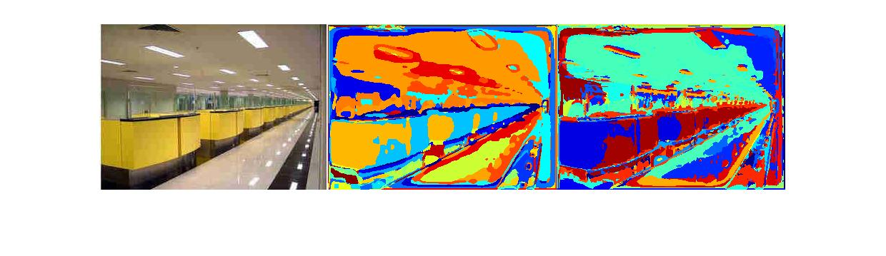

3. 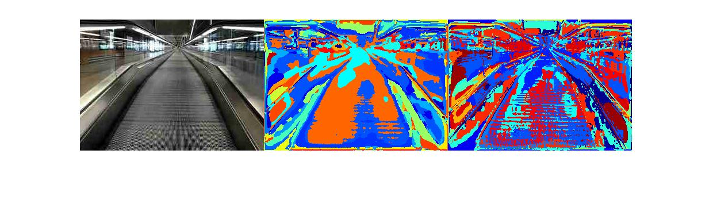

4. 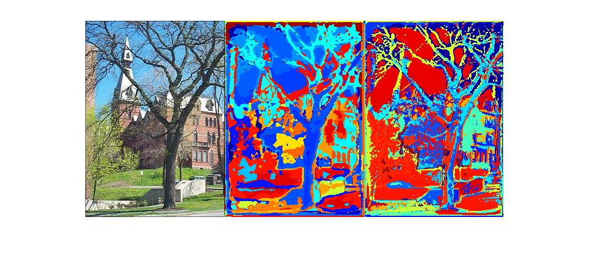

5. 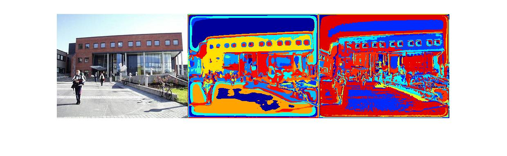

6. 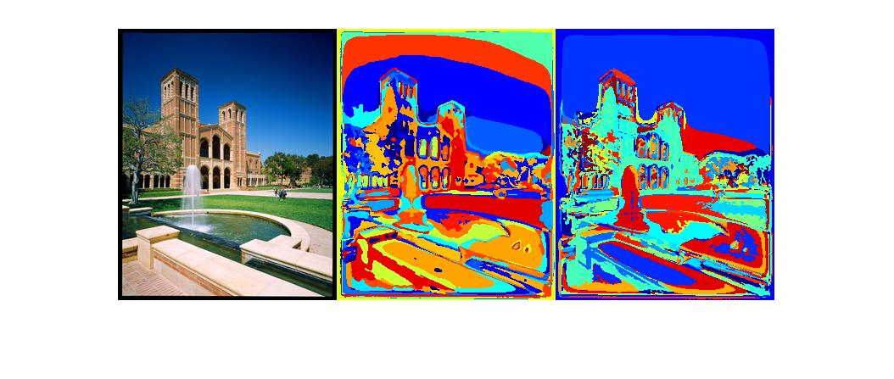

It can extrat some semantic meanings, for example, in figure 3, it can extract sky, tree and buildings. Harris seems to be better since it can extract semantic meanings of some fine details, such as in figure 2 it can extract many lights on the ceiling which the random one cannot extract.

```
confusion - harris/euclidean
     7     3     2     1     2     1     2     3
     2     9     5     2     2     0     2     0
     3     4     7     2     2     3     1     1
     1     0     2     4     3     5     4     2
     0     1     3     1     7     1     2     0
     0     0     0     3     0     7     1     0
     2     1     0     7     4     1     6     0
     5     2     1     0     0     2     2    14

accuracy = 0.38125
confusion - harris/chi2
    11     2     0     1     0     0     1     5
     1    11     4     1     2     1     2     0
     3     5    11     3     1     4     2     1
     1     0     2     5     0     3     5     1
     0     1     3     1    16     0     2     0
     0     1     0     4     0     8     0     0
     1     0     0     5     1     3     6     0
     3     0     0     0     0     1     2    13

accuracy = 0.50625
confusion - random/euclidean
     9     4     6     3     2     2     4     3
     2     9     3     2     2     3     2     2
     4     4     9     1     5     3     4     0
     1     0     1     6     2     2     5     1
     0     1     1     2     6     0     1     0
     0     2     0     1     0     4     0     0
     2     0     0     3     3     4     4     0
     2     0     0     2     0     2     0    14

accuracy = 0.38125
confusion - random/chi2
    10     4     4     1     0     2     2     4
     3    11     3     1     2     3     1     0
     3     2    11     4     3     2     3     0
     0     0     1     6     0     0     3     2
     0     1     1     1    12     2     3     0
     0     2     0     1     0     7     0     0
     0     0     0     6     3     2     7     0
     4     0     0     0     0     2     1    14

accuracy = 0.4875
```


```
best k = 14
best confusion
    14     4     4     4     0     3     2     1
     1    14     3     2     3     2     0     0
     2     0    12     1     2     3     1     1
     0     0     1     7     0     2     4     0
     0     1     0     0    12     0     3     0
     0     0     0     0     0     6     0     0
     0     1     0     6     3     3     9     0
     3     0     0     0     0     1     1    18

best accuracy = 0.575
```