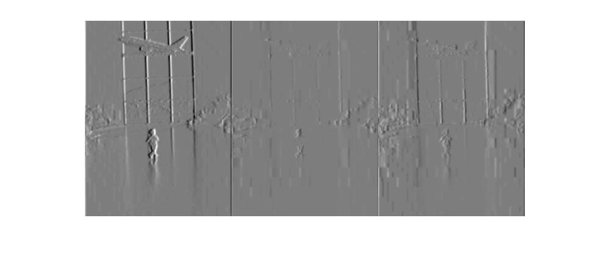
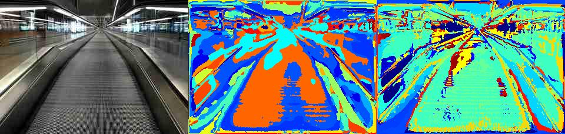

# COMP4901L Assignment5 Writeup

>WONG Yuk Chun (ycwongal, 20419764)
>
>CHEUNG Daniel (dcheungaa, 20423088)

## 1.1 Extract Filter Responses

Original


Filter 1 on L,A,B respectively


Filter 6 on L,A,B respectively


Filter 10 on  L,A,B respectively



There are some squares in the images, which is due to the lossy compression of JPG format.

The LAB color system is based on human inceptions on color, in contrast with RGB system that is based on hardware requirement. L refer to the brightness, a and b refer to the color balance. We use Lab color system to simulate human inception on colors.

## 1.2 Collect sample of points from image

Blue circles are random points, red circles are harris corners


## Q2.1 Convert image to word map

Left: original, Center: random, Right: Harris

1. 

2. 

3. 

4. 

5. 

6. 

It can extrat some semantic meanings, for example, in figure 3, it can extract sky, tree and buildings. Harris seems to be better since it can extract semantic meanings of some fine details, such as in figure 2 it can extract many lights on the ceiling which the random one cannot extract.

## Q3.2

### 1NN

```
confusion - harris/euclidean
     7     3     2     1     2     1     2     3
     2     9     5     2     2     0     2     0
     3     4     7     2     2     3     1     1
     1     0     2     4     3     5     4     2
     0     1     3     1     7     1     2     0
     0     0     0     3     0     7     1     0
     2     1     0     7     4     1     6     0
     5     2     1     0     0     2     2    14

accuracy = 0.38125
confusion - harris/chi2
    11     2     0     1     0     0     1     5
     1    11     4     1     2     1     2     0
     3     5    11     3     1     4     2     1
     1     0     2     5     0     3     5     1
     0     1     3     1    16     0     2     0
     0     1     0     4     0     8     0     0
     1     0     0     5     1     3     6     0
     3     0     0     0     0     1     2    13

accuracy = 0.50625
confusion - random/euclidean
     9     4     6     3     2     2     4     3
     2     9     3     2     2     3     2     2
     4     4     9     1     5     3     4     0
     1     0     1     6     2     2     5     1
     0     1     1     2     6     0     1     0
     0     2     0     1     0     4     0     0
     2     0     0     3     3     4     4     0
     2     0     0     2     0     2     0    14

accuracy = 0.38125
confusion - random/chi2
    10     4     4     1     0     2     2     4
     3    11     3     1     2     3     1     0
     3     2    11     4     3     2     3     0
     0     0     1     6     0     0     3     2
     0     1     1     1    12     2     3     0
     0     2     0     1     0     7     0     0
     0     0     0     6     3     2     7     0
     4     0     0     0     0     2     1    14

accuracy = 0.4875
```

Random and Harris performs similarly with Harris only better than Random by 0.01875 using "chi2" distance. As for euclidean distance, it performed exactly the same. This was a bit surprising to me, since I has a presumption that any conscious decision made to build a feature dictionary would be better than random. But it seems the result has proved me wrong.

As for the difference metrics. Chi-square seemed to perform better. Reading from https://stats.stackexchange.com/questions/99171/why-is-euclidean-distance-not-a-good-metric-in-high-dimensions, which gives insight to the reason why, is because Euclidean distance is mainly useful in our three-dimensional world, and it's meaning would fade going to higher dimensions, as Euclidean distances of points in some ND world would just approach 1 in a normalized setting, to which the Nearest-Neightbor search problem would be invalid.  This would conclude that Euclidean distance is a bad candidate for the distance metrics. Chi-square, on the other hand, is a weighted Euclidean distance. For Euclidean distance is dominated by simply the deepest depth of the dimensions, Chi-square accounts for them by standardizing and normalizing the contributions of the dimensions as well as the corresponding variances. As such, it is commonly used in statistical analysis.

### KNN

```
best k = 14
best confusion
    14     4     4     4     0     3     2     1
     1    14     3     2     3     2     0     0
     2     0    12     1     2     3     1     1
     0     0     1     7     0     2     4     0
     0     1     0     0    12     0     3     0
     0     0     0     0     0     6     0     0
     0     1     0     6     3     3     9     0
     3     0     0     0     0     1     1    18

best accuracy = 0.575
```


The best observed $k$ is 14. As we can see from the plot, larger k does not always correspond to higher accuracy. The reason why there is an optimal $k$ is because:

- $k$ should be sufficiently large to define the natural cluster of classes.
- $k$ should not be too large to factor in outliers.

The way we choose to resolve ties, is by choosing the smaller distance of the ties, which will be essentially the same as swapping to a smaller $k$ value in the NN search. This is also the easier route to implement.

## QX.1

Using the provided kernals in the LibSVM library and after tuning the hyper-parameters, we arrived with the following results:

Linear kernel accuracy = 63.75%

Radial basis (non-linear) kernal accuracy = 61.875%

The performance is better than nearest neighbors. One of the reason for this is that outliers of clusters would affect classification results in NN, whereas in SVM, the classification boundaries are smoothened, or regularized by the hyper-parameters like gamma $\gamma$, and cost $c$. Doing such would allow better classification by having boundaries conforming to the majorities of the dataset.

In our experiment, the linear and non-linear kernels performed similarly after tuning, so we can conclude that a non-linear function does not do significantly better than a linear function (non-linear functions must perform at least the same as linear). This may be because with the high dimension of the dataset (100D features), most datapoints are linearly separable, so a linear kernel can separate most data points already, and such, non-linear kernels are not needed in this case.