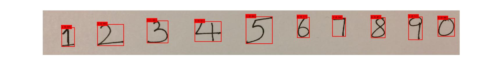
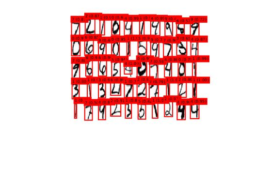

# COMP4901L Assignment6 Writeup

>WONG Yuk Chun (ycwongal, 20419764)
>
>CHEUNG Daniel (dcheungaa, 20423088)

## Part 1

### Q1.1

#### a)

$$
f(x,w)=\sigma(\sigma(x_1w_1)w_2 + x_2)\\
$$

$$
\begin{align}
\sigma(x)&=\frac{1}{1+e^{-x}}\\
\frac{d\sigma}{dx} &= \frac{e^{-x}}{(1+e^{-x})^2}\\
&=\frac{1+e^{-x}-1}{1+e^{-x}}\times\frac{1}{1+e^{-x}}\\
&=(1-\sigma(x))\sigma(x)
\end{align}\\
$$

$$
\begin{align}
\therefore\frac{\part{f}}{\part{w_2}} &= \frac{\part{f}}{\part{\sigma(x_1w_1)w_2 + x_2}}\frac{\part{\sigma(x_1w_1)w_2 + x_2}}{\part{w_2}}\\
&=(1-\sigma(\sigma(x_1w_1)w_2 + x_2))\sigma(\sigma(x_1w_1)w_2 + x_2)\sigma(x_1w_1)
\end{align}
$$

$$
\text{At the current step,}\\
\begin{align}
\frac{\part{f}}{\part{w_2}} &= (1-\sigma(\sigma(1 \cdot 0)0 + 0))\sigma(\sigma(1 \cdot 0)0 + 0)\sigma(1 \cdot 0)\\
&= 0.125
\end{align}
$$


#### b)

$$
\text{L2 loss is defined as } (y_\text{true}- y_\text{predicted})^2\\
y_\text{predicted} = f(x, w) = \sigma(\sigma(1 \cdot 0)0 + 0) = 0.5\\
\therefore \frac{\part{L}}{\part{f}} = 2(5 - 0.5)(-1)=-9
$$


$$
\begin{align}
w_2 &:= w_2 - \eta \frac{\part{L}}{\part{w_2}}\\
&= 0 - 0.5\frac{\part{L}}{\part{f}}\frac{\part{f}}{\part{w_2}}\\
&= 0 - 0.5\times-9\times0.125\\
&= 0.5625
\end{align}
$$

### Q1.2

$$
\text{Suppose a linear function: }g(x)=cx\\
\text{Then for the output of a 2-layer network}\\
\begin{align}
c(\mathbf{W}_1c(\mathbf{W}_2\mathbf{x}+\mathbf{b}_2)+\mathbf{b}_1) &= c(c\mathbf{W}_1\mathbf{W}_2\mathbf{x}+c\mathbf{W}_1\mathbf{b}_2+\mathbf{b}_1)\\
&=c(\mathbf{W}'\mathbf{x}+\mathbf{b}')
\end{align}
$$

The result corresponds to the result of a single layer network, just with a different set of weights and biases. As such, continuing on this logic, no matter how many number of hidden linear layers the network has, it will still be no different than with just 1 single linear layer.

### Q1.3

This is because ReLUs are significantly faster than sigmoid, which is already quite fast. In contrast, ReLU ony need to do a single comparison to a value, whereas sigmoid needs to deal with $e^x$, divisions, subtractions and multiplications.

### Q.1.4

Having weights as constant values would prevent the network from learning, because the gradient and propagation error would be the same. And as such, all the weight updates would subsequently also be the same.

### Q1.5

#### a) AlexNet

| Layer                                   | Tensor    | Weights  | Biases | Parameters     |
| --------------------------------------- | --------- | -------- | ------ | -------------- |
| Input Image                             | 227x227x3 | 0        | 0      | 0              |
| Conv-1 (n 96, size 11, stride 4, pad 0) | 55x55x96  | 34848    | 96     | 34944          |
| MaxPool-1 (size 3, stride 2)            | 27x27x96  | 0        | 0      | 0              |
| Conv-2 (n 256, size 5, stride 1, pad 2) | 27x27x256 | 614400   | 256    | 614656         |
| MaxPool-2 (size 3, stride 2)            | 13x13x256 | 0        | 0      | 0              |
| Conv-3 (n 384, size 3, stride 1, pad 1) | 13x13x384 | 884736   | 384    | 885120         |
| Conv-4 (n 384, size 3, stride 1, pad 1) | 13x13x384 | 1327104  | 384    | 1327488        |
| Conv-5 (n 256, size 3, stride 1, pad 1) | 13x13x256 | 884736   | 256    | 884992         |
| MaxPool-3 (size 3, stride 2)            | 6x6x256   | 0        | 0      | 0              |
| FC-1 (size 4096)                        | 4096x1    | 37748736 | 4096   | 37752832       |
| FC-2 (size 4096)                        | 4096x1    | 16777216 | 4096   | 16781312       |
| FC-3 (size 1000)                        | 1000x1    | 4096000  | 1000   | 4097000        |
| **Total**                               |           |          |        | **62,378,344** |

#### b) VGG-16

| Layer                      | Tensor      | Weights   | Biases | Parameters      |
| -------------------------- | ----------- | --------- | ------ | --------------- |
| Input Image                | 224x224x3   | 0         | 0      | 0               |
| conv3-64                   | 224x224x64  | 1728      | 64     | 1792            |
| conv3-64                   | 224x224x64  | 36864     | 64     | 36928           |
| maxpool (size 2, stride 2) | 112x112x64  | 0         | 0      | 0               |
| conv3-128                  | 112x112x128 | 73728     | 128    | 73856           |
| conv3-128                  | 112x112x128 | 147459    | 128    | 147584          |
| maxpool                    | 56x56x128   | 0         | 0      | 0               |
| conv3-256                  | 56x56x256   | 294912    | 256    | 295168          |
| conv3-256                  | 56x56x256   | 589824    | 256    | 590080          |
| conv3-256                  | 56x56x256   | 589824    | 256    | 590080          |
| maxpool                    | 28x28x256   | 0         | 0      | 0               |
| conv3-512                  | 28x28x512   | 1179648   | 512    | 1180160         |
| conv3-512                  | 28x28x512   | 2359296   | 512    | 2359808         |
| conv3-512                  | 28x28x512   | 2359296   | 512    | 2359808         |
| maxpool                    | 14x14x512   | 0         | 0      | 0               |
| conv3-512                  | 14x14x512   | 2359296   | 512    | 2359808         |
| conv3-512                  | 14x14x512   | 2359296   | 512    | 2359808         |
| conv3-512                  | 14x14x512   | 2359296   | 512    | 2359808         |
| maxpool                    | 7x7x512     | 0         | 0      | 0               |
| FC-4096                    | 4096x1      | 102760448 | 4096   | 102764544       |
| FC-4096                    | 4096x1      | 16777216  | 4096   | 16781312        |
| FC-1000                    | 1000x1      | 4096000   | 1000   | 4097000         |
| **Total**                  |             |           |        | **138,357,544** |

#### c) GoogLeNet

From the paper, $\text{# of parameters} = (2.7 + 112 + 159 + 380 + 364 + 437 + 463 + 580 + 840 + 1072 + 1388 + 1000)\text{K} = 6797.7\text{K}$

Nets ordered in desc. # of parameters: VGG16 > GoogLeNet > AlexNet

Comparing to VGG16, GoogLeNet has most of its parameters in its inception blocks, but VGG16 has most in its fully connected layers. By using instead, an average pool then a linear layer, not much more parameters are added to the model.

## Part 4

Accuracy: 0.974

confusion matrix:

```
51    0     0     0     0     0     0     0     0     0
0    52     1     0     0     0     0     0     0     0
0     0    41     1     0     0     0     0     1     0
0     0     0    61     0     1     0     1     1     0
0     0     0     0    46     0     1     1     0     0
0     0     0     0     0    45     0     1     0     0
0     0     0     0     0     0    41     0     0     0
0     0     0     0     0     0     0    47     0     2
0     0     0     1     0     0     0     0    59     0
0     0     0     0     0     0     0     1     0    44
```

7 and 9 are the most easily confused digit. If we sqeueeze the loop of 9, it looks like 7. Or in some style of 7 there is verticle stroke at top left and horizontal line in middle and we intersect both line, it looks like 9.

3 and 8 are also easily confused. If the start and end of 3 is closer to the middle, it looks like 8.

## Part 5

### Layer 1 (original image)

 

### Layer 2

 

### Layer 3 


Some filters' output are blank which mean they are not activated by this digit or their weights are zero 

Some filters' output are almost the same with other filter output

Some filters' output are the blur version of the original image

Some filters are extracting the vertical edges, some are extracting the horizontal edges

Some filters make the digit thicker, some make the digit thinner

Layer 3 is RELU layer which makes all negative value in layer 2 zero, but negative value are displayed as black, so layer2 and layer3 display the same.

## Part 6






```
image1.JPG contains 10 numbers:  1 2 3 4 5 6 3 8 7 0
image2.JPG contains 10 numbers:  1 2 3 9 5 5 7 8 1 0
image3.png contains 5 numbers:  6 0 6 2 4
image4.jpg contains 54 numbers:  1 0 7 1 1 6 3 2 6 1 4 6 3 4 1 4 2 2 0 5 4 4 1 1 1 1 4 9 0 2 5 5 1 7 7 4 4 1 7 4 2 9 1 4 3 4 2 2 9 7 4 4 1 1
```

Some digits in image4 are disconnected, so misdetection happened.

